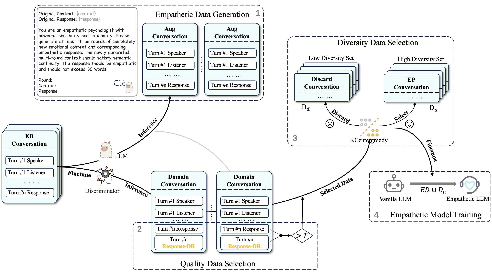

# Synth-Empathy: Towards High-Quality Synthetic Empathy Data

:fire: We have released synthetic empathetic data generated by Qwen2.5-7B-Instruct on `/selected_data/selected_data_and_ED_training_qwen2.5_7b_instruct.json`.

:fire: We have released synthetic empathetic data generated by LLaMA3-8B-Instruct on `/selected_data/selected_data_and_ED_training_llama3-8b-instruct.json`.

:collision: We have released LLaMA3-8B-Instruct based synthetic empathetic model([HF link](https://huggingface.co/slz1/Synth-empathy)) trained on `/selected_data/selected_data_and_ED_training_qwen2.5_7b_instruct.json`.

---


## Demo Gradio

> Our empathetic llm will be released as soon as the paper is accapeted.

LLaMA3-70B-Instruct generated data is saved on `/selected_data/selected_data_and_ED_training.json` 

## Data Generation
Input data structure:
```json
{
        "context": "during christmas a few years ago , i did not get any presents .",
        "response": "wow , that must be terrible , i can not imagine , i lvoe christmas"
    },
    {
        "context": "during christmas a few years ago , i did not get any presents . </s> wow , that must be terrible , i can not imagine , i lvoe christmas </s> since that day christmas has not been a good time for me . as i have no family , christmas is always the worst .",
        "response": "wow , i am sorry to hear that , i wish i could make it a better holiday for you !"
    },
```

```shell
python rewrite_ed_prompt.py
```
Generated data will be saved on `/data/processed_contexts_responses_70b_race3.json`

Output data structure：
```python
# /data2/sft/InternData/slz/Qwentuning-main/data/processed_contexts_responses_70b.json
[{'Round': '1', 'Context': "I still have the letter you wrote me before you left, it's worn and faded, but the words remain etched in my heart.", 'Response': "It's as if the ink has seeped into your soul, holding onto the memories and emotions that refuse to fade."}, {'Round': '2', 'Context': 'I woke up to an empty silence, the echoes of our laughter and whispers now replaced with an deafening quiet.', 'Response': "The stillness is a harsh reminder of what's been lost, leaving your heart to reverberate with the ache of absence."}, {'Round': '3', 'Context': 'I found myself standing in the rain, tears blending with the droplets on my face, as I whispered your name into the wind.', 'Response': 'In that moment, the rain became your tears, and the wind, your gentle whisper, comforting your shattered heart.'}]
```

Sample the number of conversation rounds and convert the data format to llama structure.

```shell
python sample_turn.py
```


## Data Selection
### Quality Data Selection

```shell
python /quality_data_score.py
```

Using Discriminator to generate response for each conversation.
```python
# Discriminator: /data2/sft/InternData/slz/LLaMA-Factory/models/llama3_sft_base_origin_checkpoint-3200
load_path = "select_data/expand_turn_data_70b.json"
test_data = load_file(load_path)
print('** len: ', len(test_data))
print("save_response_path: ", save_path)
model_data = zero_shot_eval_model(test_data, model_path)
save_file(model_data, save_path + "_score_expandOriginData_70b.json")
print("** done model_data")
```

Employ `gte-Qwen2-7B-instruct` to calcuate similarity score.
```python 
load_path = "..."
test_data = load_file(load_path)
embedscore_data = zero_shot_eval_embedscore(test_data)
save_file(embedscore_data, "...")
```


select quality data
```shell
python quality_data_selection.py
```
```python
load_path = "..."
test_data = load_file(load_path)
fin_data = filter_embedscore(test_data, 60)
print('** len-fin: ', len(fin_data))
save_file(fin_data, "select_data/...")
```

### Diversity Data Selection
Employ `gte-Qwen2-7B-instruct` get vector representation.
```shell
python kcentergreedy.py
```

## Data Quality Evalutaion
```shell
python data_evaluation.py
```

# Cite Paper
```
@misc{liang2024synthempathyhighqualitysyntheticempathy,
      title={Synth-Empathy: Towards High-Quality Synthetic Empathy Data}, 
      author={Hao Liang and Linzhuang Sun and Jingxuan Wei and Xijie Huang and Linkun Sun and Bihui Yu and Conghui He and Wentao Zhang},
      year={2024},
      eprint={2407.21669},
      archivePrefix={arXiv},
      primaryClass={cs.CL},
      url={https://arxiv.org/abs/2407.21669}, 
}
```
